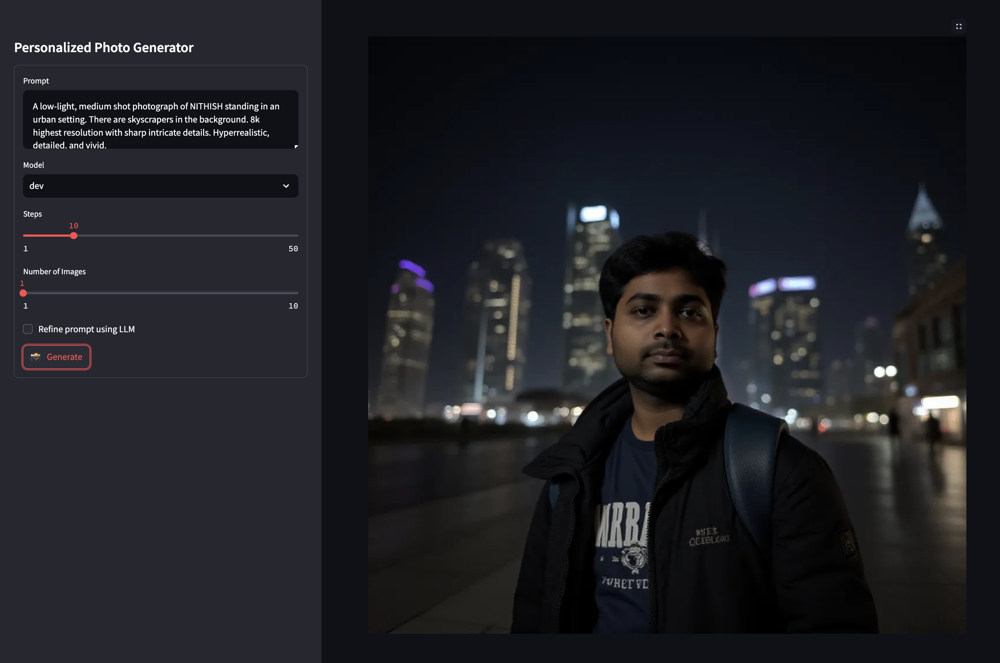

# FLUX Fine Tuning

This application provides an application to run a fine-tuned FLUX.1 model using [Replicate](https://replicate.com/) platform with an option to refine the prompt using a local LLM via Ollama.



Finetuning can be done with a few images (10-20). The instructions for finetuning can be found [here](https://replicate.com/docs/get-started/fine-tune-with-flux). Training requires about $2.

## Installation

To get started with the project, clone the repository and install the required dependencies:

```bash
pip install -r requirements.txt
```

## Configuration

The API keys are read from the Streamlit secrets stored in the `.streamlit/secrets.toml` file.

It can be created from the `secrets.example.toml` file provided.

```
REPLICATE_API_TOKEN = ""
MODEL_NAME = ""
```

MODEL_NAME is the name of the fine tuned model.

## Usage

In order to run the LLM [Llama](https://www.llama.com/) locally, you can run it via [Ollama](https://ollama.com/library/llama3). The interaction with Ollama is done using LangChain.

```bash
ollama run llama3
```

To run the image generation, use the following command in a different shell:

```bash
streamlit run personalized_images.py
```

The outputs will be saved to the outputs folder with a timestamp for each file.

## License

This project is licensed under the MIT License.
